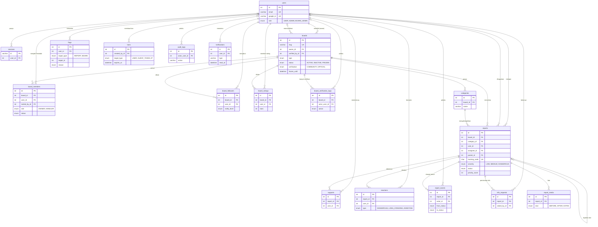

# Struktur Database T!indak

Database memakai MySQL 8 (atau MariaDB) lewat Prisma 7. Skema tunggal ada di [`server/prisma/schema.prisma`](../server/prisma/schema.prisma) dan setiap perubahan tercatat sebagai migrasi di `server/prisma/migrations`.

## Aturan Penamaan

- Nama model di kode memakai PascalCase bahasa Inggris (`BoardMember`), nama tabel memakai snake_case jamak (`board_members`).
- Nama kolom di kode memakai camelCase (`createdAt`), di database snake_case (`created_at`).
- Setiap tabel punya primary key `id` (auto increment). Kolom relasi berakhiran `_id`.
- Nilai tetap seperti role, status, dan tingkat bahaya disimpan sebagai enum, bukan teks bebas.

## Diagram Relasi (ERD)

Diagram ini ditampilkan otomatis oleh GitHub. Kolom yang ditulis hanya kunci dan kolom penting.

## Penjelasan Tabel

| Kelompok    | Tabel                                                       | Fungsi                                                                                      |
| ----------- | ----------------------------------------------------------- | ------------------------------------------------------------------------------------------- |
| Akun        | `users`, `sessions`                                         | Akun warga dan staf, serta sesi login (cookie httpOnly)                                     |
| Board       | `boards`, `board_members`, `categories`, `board_followers`  | Tempat pengaduan, Penindak Utama dan Penindak, kategori laporan, dan pengikut               |
| Laporan     | `reports`, `report_media`, `report_events`, `info_requests` | Laporan, foto sebelum dan sesudah, riwayat perubahan status, dan permintaan info ke pelapor |
| Partisipasi | `supports`, `reactions`                                     | Dukungan dan reaksi warga yang membentuk skor prioritas                                     |
| Moderasi    | `flags`, `bans`, `audit_logs`                               | Tanda pelanggaran, ban akun/perangkat/IP, dan catatan semua aksi Admin                      |
| Kepercayaan | `board_ratings`, `board_verification_logs`                  | Rating bintang Board dan riwayat verifikasi Official                                        |
| Notifikasi  | `notifications`                                             | Notifikasi per user                                                                         |

## Keputusan Desain

- **Hapus berantai dipilih per relasi.** Data milik Board atau laporan (foto, riwayat, dukungan) ikut terhapus (`Cascade`). Data yang perlu jejak (pelaku audit log, pemberi ban, pelapor) cukup dikosongkan (`SetNull`) agar riwayat tetap utuh. Board tidak bisa dihapus selama pemiliknya masih ada (`Restrict`).
- **Satu user satu aksi.** Kombinasi unik mencegah dukungan, reaksi, rating, dan tanda ganda, misalnya `supports (report_id, user_id)` dan `flags (target_type, target_id, user_id)`.
- **Tanda dan audit log bersifat polimorfik.** `flags` dan `audit_logs` menyimpan `target_type` + `target_id` karena targetnya bisa laporan atau Board. Integritasnya dijaga di service, dan kolom itu diberi index.
- **Angka yang sering dibaca disimpan di laporan.** `support_count`, jumlah reaksi, `priority_score`, dan `hot_score` dihitung ulang saat ada perubahan, sehingga feed dan antrean tidak perlu menghitung ulang setiap kali dibuka.
- **Data sensitif tidak disimpan mentah.** Password memakai bcrypt, kode rahasia pelacakan dan IP disimpan sebagai hash SHA-256.
- **Index mengikuti query.** Contoh: `reports (board_id, status)` untuk antrean Penindak, `notifications (user_id, read_at)` untuk jumlah belum dibaca, `bans (target_type, target_value)` untuk cek ban.
